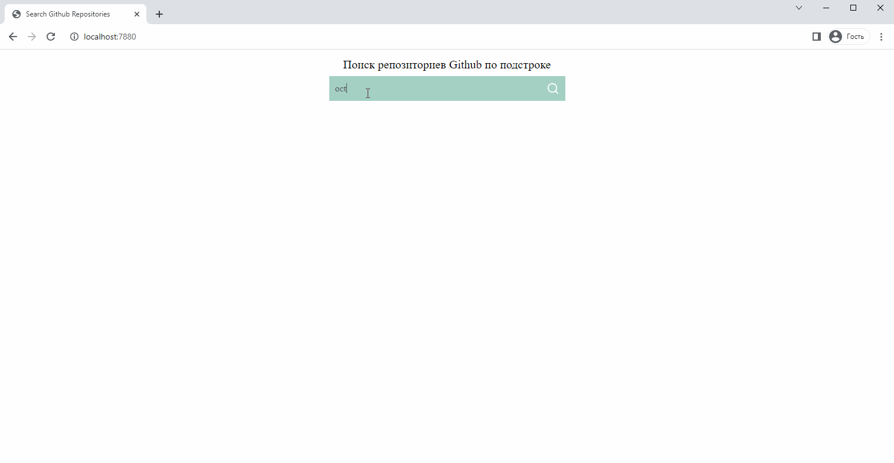

# Search Github repositories

You can search for a repository by substring on Github.


---

### How to start

To obtain data, you need to log in to Github and get a personal token in the section:
_Settings -> <> Developer settings -> Personal access tokens -> Fine-grained tokens_

The received token must be inserted into the file **js/main.js** line 48-50:

```sh
const octokit = new Octokit({
	auth: 'Your_tokin'
});
```

---

### Used tools:

- JavaScript
- Sass
- HTML
- Octokit
